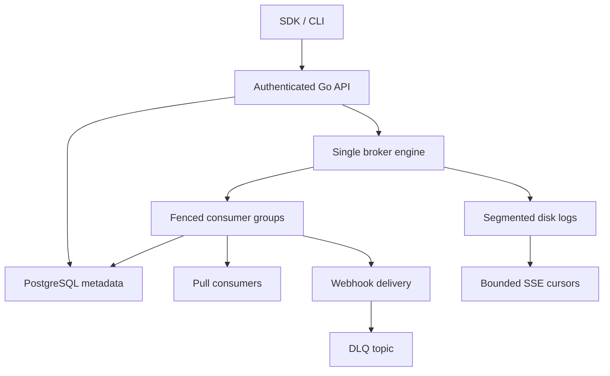

# EventCore

**Status: development baseline; v0.1.0 is not released.** A real single-node event log and delivery engine, built in Go. Events live in segmented disk files, never in PostgreSQL CRUD rows. PostgreSQL holds users, workspace membership, sessions, API key digests, committed group offsets, webhook subscriptions, attempts and audit records.

EventCore is intended for self-hosted event-driven services, IoT ingestion and replayable application streams. This repository prioritizes correctness and explicit failure behavior before the dashboard.

## What works

- Topic creation, immutable partition counts and workspace-isolated namespaces.
- Keyed FNV-1a 64-bit partition assignment; unkeyed round-robin routing.
- Ordered per-partition offsets, length-prefixed CRC32 records, segment rotation and fsync-before-ack.
- Exclusive process lock on the data directory, restart recovery, repair of an incomplete active tail and refusal of complete-record corruption.
- Single and bounded, non-atomic batch publication; optional JSON Schema 2020-12 validation on event `data`. External schema references are prohibited.
- Fenced consumer groups, deterministic partition assignment, membership expiry, batch acknowledgments, nack/redelivery, visibility leases and durable next-offset commits.
- Safe group resets when no members are active; replay by resetting offsets or reading immutable retained ranges.
- Time/size retention of sealed segments and explicit HTTP 416 for offsets that have been removed.
- HTTPS webhooks with HMAC timestamp signatures, encrypted secrets, persistent attempt state, bounded exponential retry, delivery logs, pause/resume and durable DLQ routing.
- Bounded SSE streams using disk cursors and notification channels, with connection limits and slow-client write deadlines.
- PostgreSQL-backed bcrypt login, HttpOnly sessions, CSRF tokens, backend role checks, scoped expiring API keys, revocation and rate limits.
- Python SDK/CLI and typed TypeScript SDK; safe GET retries, explicit mutation failures and fenced batch acknowledgments.
- Disk-capacity admission checks, partition failure fencing and truthful readiness.
- Prometheus-format publication/consumption/disk/uptime metrics, structured logs, health/readiness endpoints, non-root containers and automated CI.

## Architecture



The broker, coordinator and delivery worker share one process intentionally. There is one authoritative broker, no replication and no failover. Do not start a second API instance against the same database/data set. The disk lock protects processes sharing the same directory, and a PostgreSQL session advisory lock rejects a second process sharing metadata. These are single-process startup guards, not replicated cluster leadership.

## Run locally

Requirements: Docker Engine and Compose v2. Copy `.env.example` to `.env`. Generate independent credentials:

```bash
python - <<'PY'
import secrets, base64
print('POSTGRES_PASSWORD=' + secrets.token_hex(24))
print('BOOTSTRAP_PASSWORD=' + secrets.token_hex(24))
print('WEBHOOK_ENCRYPTION_KEY=' + base64.b64encode(secrets.token_bytes(32)).decode())
PY
```

Put the generated values in `.env`, set `COOKIE_SECURE=false` **only for local HTTP**, and run:

```bash
docker compose up --build -d --wait
curl http://localhost:8080/ready
```

Production requires a TLS reverse proxy, `COOKIE_SECURE=true`, encrypted backups of **both** log and metadata volumes, and restricted access to the host. The default Compose binding is loopback. The bootstrap password creates an owner only when that email does not exist; changing it does not reset an existing password. Remove bootstrap credentials from the deployed environment after provisioning (adjust Compose accordingly). Keep the encryption key stable or existing webhook secrets will be unreadable.

Login with `POST /v1/auth/login` and the bootstrap email/password/workspace. Retain the session cookie and send `X-CSRF-Token` on cookie-authenticated mutations. Create an API key using `POST /v1/keys`. Its raw value is returned once. See [API reference](docs/API.md).

```bash
python -m pip install -e packages/sdk-python
export EVENTCORE_URL=http://localhost:8080
export EVENTCORE_API_KEY='your-created-key'
eventcore topics create orders --partitions 4
eventcore publish orders --type order.created --key customer_123 --data '{"order_id":"123"}'
```

Use an admin key to create topics and groups; give application producers only `topic:orders:produce`, and consumers `topic:orders:consume`. `topic:orders:read` permits retained-range inspection and SSE. Dashboard browser credentials belong in cookies, never localStorage.

## Delivery guarantees

Durable acknowledgment means the append completed and `fsync` returned successfully on the configured filesystem. Actual power-loss durability depends on the filesystem, host and disk honoring synchronization. Publication failures after a write may be ambiguous; producer idempotency is not implemented and the SDKs never retry publication automatically.

Group offsets mean **the next event to process**. `next_offset=100` and `committed=70` gives `lag=30`. A batch ack commits all events in that partition batch, so applications must finish the entire batch first. A nack or expired visibility lease causes redelivery. Ownership changes invalidate outstanding tokens and generations; clients must rejoin on HTTP 409. Processed side effects may repeat during crashes or rebalances. Applications should use event IDs for sink deduplication.

Webhook attempts are persisted before the network operation. A successful HTTP delivery is recorded before acknowledging the source event; terminal failure is appended durably to `<topic>.DLQ` before acknowledging. A crash between external delivery/DLQ append and the metadata update can produce duplicates. **At-least-once; never exactly-once.** SSE is a cursor-based observation transport and does not commit consumer-group offsets. Resume with `Last-Event-ID`; retain your cursor outside EventCore.

Retention removes only complete sealed segments. The active segment stays, so byte limits are approximate, divided across partitions and may be exceeded by active segments. Lagging groups are not silently fast-forwarded; stop their members and reset explicitly if retention has removed their offset.

## Validation

```bash
go test -race ./...
go vet ./...
npm ci --prefix packages/sdk-js
npm test --prefix packages/sdk-js
PYTHONPATH=packages/sdk-python python -m unittest discover -s packages/sdk-python/tests -v
```

Set `TEST_DATABASE_URL` for real PostgreSQL tests; without it those tests **skip**, rather than replacing PostgreSQL with a mock. CI runs these tests with PostgreSQL and separately starts Docker Compose, publishes 10,000 events using the Python SDK, checks offsets/key ordering/lag/two-member assignment, stops a member, drains and commits, restarts the broker and replays 10,001 retained events. The HTTP-500/retry/DLQ integration test injects a failing HTTP transport; a real external webhook endpoint test remains a release requirement.

Read [storage format](docs/STORAGE.md), [acceptance coverage and release gaps](docs/STATUS.md), and [security and operational limits](docs/SECURITY.md). Benchmarks are reproducible with `go test -bench . -benchmem ./internal/storage`; report your own filesystem and fsync behavior. No Kafka-scale throughput claim is made.

## Before v0.1.0

The dashboard, WebSocket group consumers, timestamp/range replay sessions, replay to another topic, DLQ retry/discard management, producer idempotency, richer schema lifecycle, user/password-reset/role-management flows, safe topic deletion, disk-pressure warning UX, OpenTelemetry, full OpenAPI coverage, measured load scenarios and release screenshots/evidence remain open. This is not a complete production release. See the tracked gap list for acceptance work, rather than treating every prompt requirement as implemented.

Future clustering would require persistent broker identity, coordinated partition leadership, follower replication, leader fencing and failover. None of those is simulated here. Redis is intentionally absent because it currently has no authoritative coordination role.
